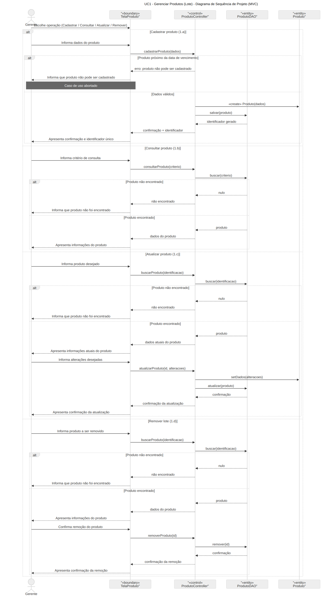
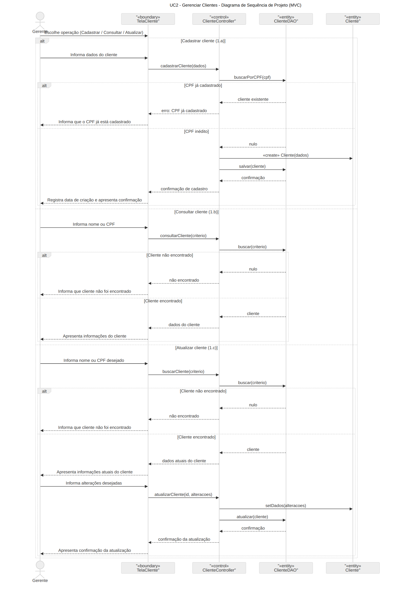
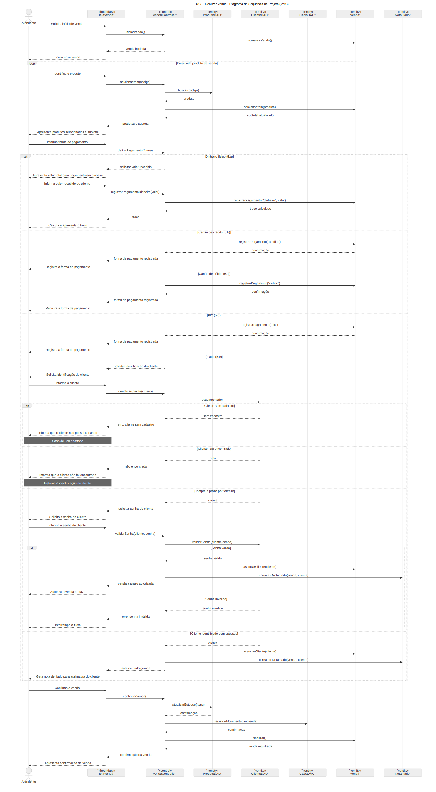
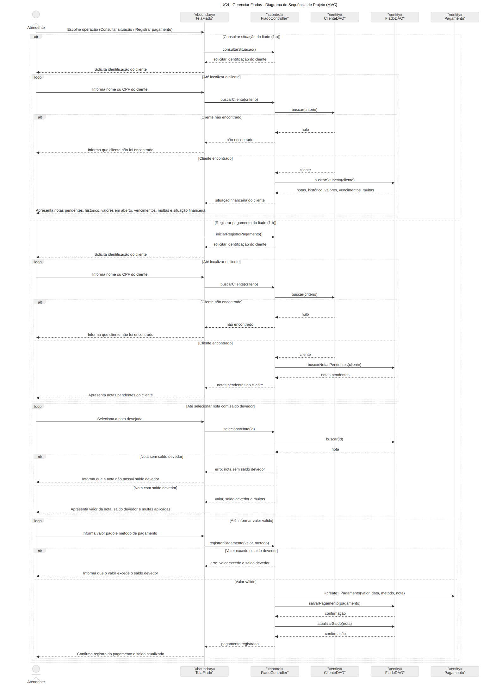
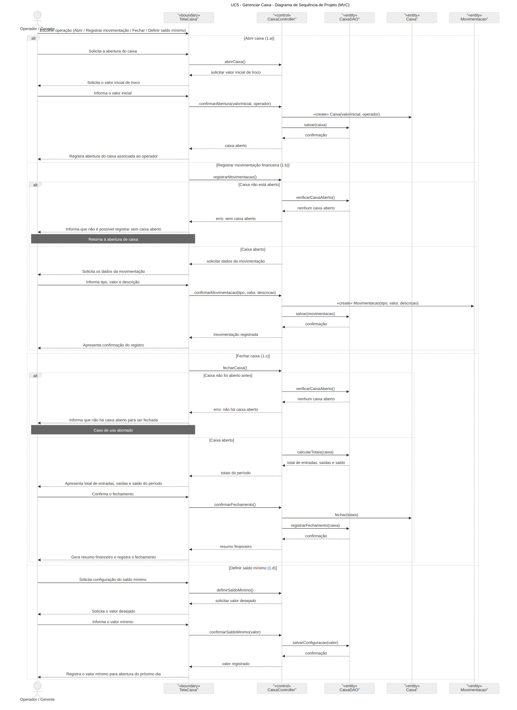
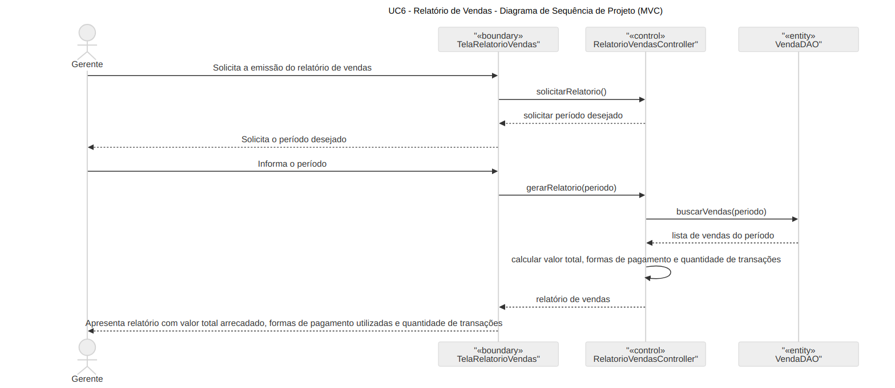
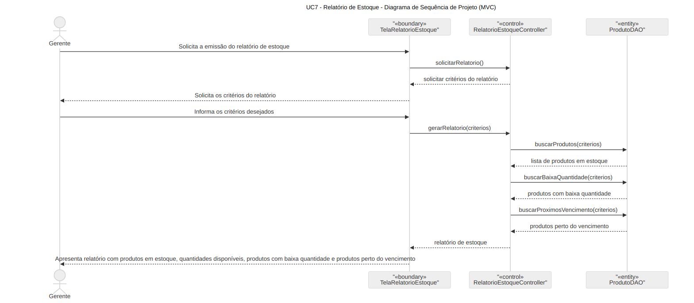
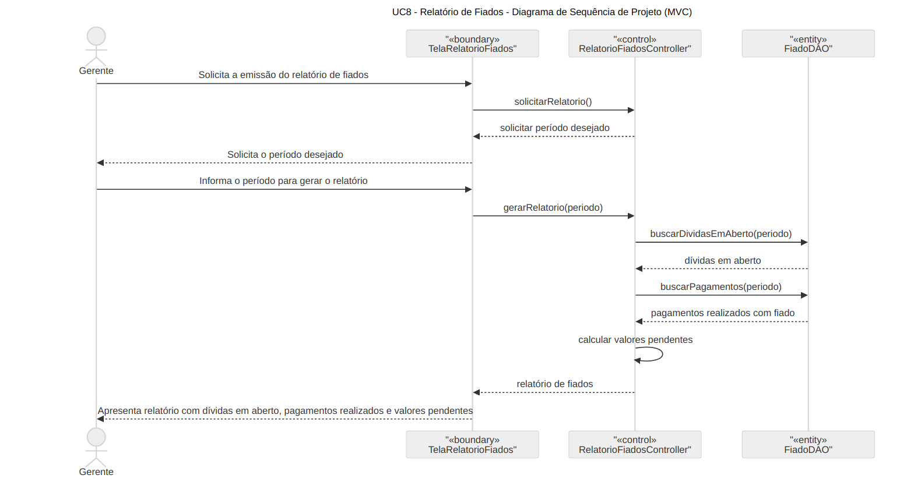

## Sumário

1. [VISÃO GERAL](#1-visão-geral)
2. [DIAGRAMA DE ATIVIDADES](#2-diagrama-de-atividades)
3. [LEVANTAMENTO DE REQUISITOS](#3-levantamento-de-requisitos)

   3.1. [REQUISITOS FUNCIONAIS](#31-requisitos-funcionais)

   3.2. [REQUISITOS NÃO FUNCIONAIS](#32-requisitos-não-funcionais)

4. [DETALHAMENTO DE REQUISITOS](#4-detalhamento-de-requisitos)
5. [CASOS DE USO EXPANDIDOS](#5-casos-de-uso-expandidos)
6. [DIAGRAMAS DE SEQUÊNCIA](#6-diagramas-de-sequência)

---
## 1. VISÃO GERAL
Este projeto propõe um sistema de gestão para minimercados focando em controle de vendas, estoque e relacionamento com clientes. O sistema permite cadastro de produtos por lote atribuindo códigos QR únicos para cada unidade, prevenindo venda de produtos vencidos e duplicidade nas leituras. O processo de venda ocorre via leitura de QR codes com validações em tempo real de validade e disponibilidade, suportando pagamento em dinheiro e venda a prazo (fiado), enquanto PIX e cartão são processados por máquina de cartão externa. A funcionalidade de fiado é restrita a clientes cadastrados com critérios de idade mínima, status ativo e limite de crédito. O sistema controla dívidas, inclui alertas automatizados para produtos vencidos e pagamentos em atraso, além de controle de caixa e relatórios gerenciais.

---
## 2. DIAGRAMA DE ATIVIDADES

---

## 3. LEVANTAMENTO DE REQUISITOS

---
### 3.1. REQUISITOS FUNCIONAIS

1. Cadastrar produtos por lote
2. Consultar produto individualmente
3. Emitir QR Code únicos por lote
4. Alertar sobre lotes próximos ao vencimento
5. Baixa automática no estoque após venda
6. Atualizar cadastros de lotes
7. Remover lotes cadastrados
8. Validar autenticidade e integridade do QR Code durante a venda
9. Verificar validade e disponibilidade do produto na venda
10. Oferecer suporte a diferentes formas de pagamento
11. Calcular troco automaticamente
12. Remover item da venda antes da finalização
13. Gerar nota fiscal após a venda
14. Gerar nota para assinatura em caso de venda fiada
15. Impedir venda fiada para clientes com notas atrasadas
16. Cadastrar clientes para gerenciar notas de fiado
17. Definir senha para compras não realizadas pelo titular
18. Alertar sobre notas de fiado perto do vencimento
19. Registrar e exibir histórico de compras e dívidas do cliente
20. Registrar pagamento total ou parcial das notas de fiado
21. Definir dia de vencimento das notas de fiado para cada cliente
22. Aplicar multa de 2% após 2 dias de atraso
23. Bloquear clientes com mais de 20 dias sem pagar
24. Registrar todas as movimentações financeiras
25. Definir o valor inicial de troco para abertura de caixa
26. Gerar resumo financeiro ao fim do expediente
27. Definir saldo mínimo para abertura de caixa no dia seguinte
28. Gerar relatórios de vendas por período
29. Gerar relatório do estoque destacando produtos com baixa quantidade ou perto do vencimento
30. Gerar relatório de dívidas em aberto e pagamentos a prazo
31. Exigir login com perfis distintos para operadores e gerente

### 3.2. REQUISITOS NÃO FUNCIONAIS

1. O sistema deve ser desenvolvido usando a linguagem Java e o banco de dados MySQL/MariaDB.
2. O sistema deve funcionar em máquinas com no mínimo 4GB de RAM.
3. O sistema deve responder a operações de venda em menos de 2 segundos.
4. O sistema deve garantir a integridade dos dados durante as vendas e pagamentos.
5. O sistema deve armazenar as senhas dos clientes cadastrados de forma segura.
6. O sistema deve registrar um log de ações realizadas por cada usuário para fins de auditoria.
7. O sistema deve ser tolerante a falhas durante operações internas, como registro de venda, baixa de estoque e movimentações de caixa, revertendo operações incompletas automaticamente (ACID).

## 4. DETALHAMENTO DE REQUISITOS

| **RF1. Cadastrar produtos por lote** |
|:---|
| **Descrição:** O sistema deve permitir que o usuário realize o cadastro de produtos utilizando o controle por lote. Onde cada lote deve possuir identificação própria, permitindo rastreamento, controle de validade, quantidade e movimentação individual no estoque. |
| **Fontes:** Gerente do estabelecimento |
| **Usuários:** O gerente |
| **Informações de entrada:** O usuário deverá informar nome do produto, código do produto, número do lote, data de fabricação, data de vencimento, fornecedor, custo e quantidade. |
| **Informações de saída:** O sistema deverá mostrar que o cadastro foi concluído com sucesso e atualizar as informações no estoque. |
| **Restrições lógicas:** - A quantidade cadastrada deverá ser maior que 0 - O produto deverá ter data de validade - Não cadastrar produtos perto da data de vencimento |

---

| **RF2. Consultar produto individualmente** |
|:---|
| **Descrição:** O sistema deve permitir que o usuário consulte os produtos cadastrados no estoque de maneira individual, e deverá mostrar informações relacionadas ao produto e lotes cadastrados. |
| **Fontes:** Gerente do estabelecimento e atendentes |
| **Usuários:** Gerente, atendente |
| **Informações de entrada:** O usuário deve informar o nome do produto, número do lote ou QRCode para realizar a consulta. |
| **Informações de saída:** O sistema deverá apresentar as informações do produto, como nome, quantidade disponível, lotes cadastrados, datas de vencimento e valor do produto. |
| **Restrições lógicas:** - O produto a ser consultado precisará existir na base de dados - Apenas usuários autorizados poderão acessar essas informações |

---

| **RF3. Emitir QR Code únicos por lote** |
|:---|
| **Descrição:** O sistema deverá gerar QR Code únicos para cada lote de produtos cadastrado, permitindo identificação do item do lote, controle das movimentações no estoque. |
| **Fontes:** Gerente do estabelecimento |
| **Usuários:** O gerente |
| **Informações de entrada:** O usuário deve informar os dados relacionados ao lote. |
| **Informações de saída:** O sistema deverá gerar um QR Code único vinculado ao lote cadastrado, permitindo a consulta das informações do lote e consequentemente do produto. |
| **Restrições lógicas:** - O sistema deve garantir que cada QR Code esteja vinculado a apenas um lote cadastrado - O sistema não deve permitir que sejam gerados QR Code para lotes consumidos ou inexistentes |

---

| **RF4. Alertar sobre lotes próximos ao vencimento** |
|:---|
| **Descrição:** O sistema precisa monitorar as datas de vencimento dos lotes de produtos e emitir um alerta quando a data estiver perto do período crítico (entre 10 a 30 dias antes do vencimento). |
| **Fontes:** Gerente do estabelecimento |
| **Usuários:** O gerente |
| **Informações de entrada:** O sistema deve verificar e comparar a data atual e o dia de vencimento dos lotes cadastrados para identificar itens perto do vencimento. |
| **Informações de saída:** O sistema deve gerar alertas quando estiver um ou mais lotes de produto próximos do vencimento por meio de notificações |
| **Restrições lógicas:** - O sistema não deve gerar alertas duplicados para o mesmo lote dentro do mesmo período configurado - O sistema deve emitir alertas apenas para produtos perto do vencimento, ignorando lotes consumidos |

---

| **RF5. Baixa automática no estoque após venda** |
|:---|
| **Descrição:** O sistema deve atualizar automaticamente a quantidade de um produto disponível no estoque após a conclusão de uma venda. |
| **Fontes:** Gerente do estabelecimento e atendentes |
| **Usuários:** Atendente ou gerente |
| **Informações de entrada:** Durante a venda do produto, o sistema deve analisar os dados da operação (produto, lote, etc.) |
| **Informações de saída:** O sistema deve reduzir automaticamente a quantidade do produto do lote que foi vendido e registrar essa movimentação. |
| **Restrições lógicas:** - O sistema deve permitir apenas atualizar os lotes vinculados à venda realizada - O sistema deverá impedir inconsistências causadas por vendas simultâneas |

---

| **RF6. Atualizar cadastros de lotes** |
|:---|
| **Descrição:** O sistema deverá permitir a atualização das informações dos lotes cadastrados, para garantir que os dados permaneçam corretos e em dia. |
| **Fontes:** Gerente do estabelecimento |
| **Usuários:** Atendente ou gerente |
| **Informações de entrada:** O sistema deve receber novos dados para poder atualizar o lote selecionado. |
| **Informações de saída:** O sistema deverá atualizar as informações do lote no banco de dados e registrar a alteração realizada. |
| **Restrições lógicas:** - O sistema não deve permitir atualização de lotes inexistentes - O sistema deve validar os dados antes de salvar as alterações - O sistema deve impedir alterações inconsistentes (ex: quantidade de itens do lote ser um valor negativo) |

---

| **RF7. Remover lote de produtos** |
|:---|
| **Descrição:** O sistema deve permitir a remoção de um lote de produtos previamente cadastrado no estoque. |
| **Fontes:** Gerente do estabelecimento e atendentes |
| **Usuários:** Gerente |
| **Informações de entrada:** O usuário deve informar um critério de identificação do lote e confirmar sua remoção. |
| **Informações de saída:** O sistema deverá remover o lote do estoque e apresentar uma confirmação da operação. |
| **Restrições lógicas:** - O sistema não deve permitir a remoção de lotes inexistentes - O sistema deve solicitar a confirmação antes de efetuar a remoção do lote |

---

| **RF8. Validar QR Code durante a venda do produto** |
|:---|
| **Descrição:** O sistema deverá validar a autenticidade e integridade do QR Code durante a venda do produto, garantindo que as informações do lote e do item sejam legítimas e consistentes. |
| **Fontes:** Gerente do estabelecimento e atendentes |
| **Usuários:** Atendente ou gerente |
| **Informações de entrada:** O sistema deve receber o QR Code do produto no momento da venda para verificar os dados do produto vinculado ao lote. |
| **Informações de saída:** O sistema deve permitir ou bloquear a venda do produto com base na validação do QR Code e nas informações do lote cadastrado. |
| **Restrições lógicas:** - O sistema não deverá aceitar QR Code inválidos, duplicados ou não cadastrados - O sistema deverá garantir correspondência entre o QR Code e o lote vinculado ao produto - O sistema deverá impedir a reutilização indevida do mesmo registro de venda |

---

| **RF9. Verificar a validade e disponibilidade do produto** |
|:---|
| **Descrição:** O sistema deverá verificar a validade e disponibilidade do produto no momento do registro da venda, impedindo a comercialização de itens vencidos ou sem estoque disponível. |
| **Fontes:** Gerente do estabelecimento |
| **Usuários:** Atendente ou gerente |
| **Informações de entrada:** O sistema deverá receber os dados do produto ou lote informado durante a venda para verificar sua validade e disponibilidade em estoque. |
| **Informações de saída:** O sistema deverá permitir ou bloquear a venda do item com base na validade do produto e na quantidade disponível em estoque. |
| **Restrições lógicas:** - O sistema não deverá permitir a venda de produtos vencidos ou sem estoque - O sistema deverá validar a disponibilidade do lote antes da conclusão da venda |

---

| **RF10. Oferecer suporte a diferentes formas de pagamento durante a venda** |
|:---|
| **Descrição:** O sistema deverá permitir o registro de diferentes formas de pagamento utilizadas durante a venda, possibilitando o armazenamento das informações da transação realizada externamente. |
| **Fontes:** Gerente do estabelecimento |
| **Usuários:** Atendente ou gerente |
| **Informações de entrada:** O sistema deverá receber a forma de pagamento selecionada para a venda (PIX, cartão de crédito ou débito, prazo). |
| **Informações de saída:** O sistema deverá registrar a forma de pagamento associada à venda para controle. |
| **Restrições lógicas:** - O sistema deverá permitir apenas formas de pagamento previamente cadastradas - O sistema não deve concluir uma venda sem o registro de uma forma de pagamento cadastrada |

---

| **RF11. Cálculo de troco em caso de dinheiro físico** |
|:---|
| **Descrição:** O sistema deverá calcular automaticamente o valor do troco em pagamentos realizados com dinheiro físico, tendo em vista o valor total da compra e o valor recebido pelo atendente. |
| **Fontes:** Gerente do estabelecimento |
| **Usuários:** Atendente ou gerente |
| **Informações de entrada:** O sistema deverá receber o valor total da compra e o valor entregue pelo cliente em dinheiro físico. |
| **Informações de saída:** O sistema deverá calcular e exibir automaticamente o valor do troco referente a venda. |
| **Restrições lógicas:** - O sistema não deverá calcular troco para formas de pagamento diferentes de dinheiro físico - O sistema não deverá permitir a conclusão da venda caso o valor recebido seja inferior ao valor total da compra - O sistema deverá considerar apenas valores válidos e positivos para cálculo do troco |

---

| **RF12. Permitir remoção de itens antes de finalizar a venda** |
|:---|
| **Descrição:** O sistema deverá permitir que o operador remova itens adicionados à venda antes da finalização da compra. |
| **Fontes:** Gerente do estabelecimento |
| **Usuários:** Atendente ou gerente |
| **Informações de entrada:** O sistema deverá receber a solicitação de remoção de um item previamente adicionado à venda em andamento. |
| **Informações de saída:** O sistema deverá remover o item da venda, atualizar o valor total da compra e restaurar a disponibilidade. |
| **Restrições lógicas:** - O sistema não deve permitir a remoção dos itens após a conclusão da compra - O sistema deve solicitar a senha do usuário para remover o item |

---

| **RF13. Gerar nota fiscal ao fim da venda** |
|:---|
| **Descrição:** O sistema deverá gerar uma nota fiscal ao final da venda, contendo todos os dados importantes para a compra. |
| **Fontes:** Gerente do estabelecimento |
| **Usuários:** Atendente ou gerente |
| **Informações de entrada:** O sistema deverá receber os dados da venda finalizada. |
| **Informações de saída:** O sistema deverá emitir uma nota fiscal contendo os itens vendidos, o valor total, impostos e a forma de pagamento. |
| **Restrições lógicas:** - O sistema deverá não permitir emissão duplicada da mesma nota fiscal para uma única venda |

---

| **RF14. Gerar nota para assinatura em vendas fiado** |
|:---|
| **Descrição:** O sistema deverá gerar uma nota de pagamento fiado para assinatura do cliente, registrando a dívida associada à venda realizada. |
| **Fontes:** Gerente do estabelecimento |
| **Usuários:** Atendente ou gerente |
| **Informações de entrada:** Durante o processo de venda, a forma de pagamento deve ser a prazo (fiado). |
| **Informações de saída:** O sistema deverá gerar uma nota de fiado contendo os dados da venda, valor devido, vencimento e espaço para assinatura do cliente. |
| **Restrições lógicas:** - O sistema não deverá permitir geração de nota de fiado para clientes não cadastrados - O sistema deverá permitir vendas fiadas apenas para clientes maiores de 18 anos |

---

| **RF15. Bloquear fiado para clientes com notas em atraso** |
|:---|
| **Descrição:** O sistema deverá impedir que sejam realizadas vendas na modalidade fiado, caso o cliente em questão tenha notas vencidas em aberto. |
| **Fontes:** Gerente do estabelecimento |
| **Usuários:** Atendente ou gerente |
| **Informações de entrada:** Durante o processo de venda, a forma de pagamento deve ser a prazo (fiado) e o sistema deve verificar a situação do cliente com base na data das vencimento das notas. |
| **Informações de saída:** O sistema deverá autorizar ou bloquear a venda de produtos com base na existência de notas de fiado atrasadas. |
| **Restrições lógicas:** - O sistema deverá levar em conta apenas notas em aberto para avaliação do atraso |

---

| **RF16. Cadastro de clientes para gerenciar notas de fiado** |
|:---|
| **Descrição:** O sistema precisa permitir uma seção para o cadastro de clientes, com a finalidade de gerenciar as notas de fiado dos clientes e acompanhar suas dívidas. |
| **Fontes:** Gerente do estabelecimento |
| **Usuários:** Atendente ou gerente |
| **Informações de entrada:** O sistema deve receber os dados cadastrais do cliente (a detalhar, pense em usar o diagrama Entidade-Relacionamento para ter uma base). |
| **Informações de saída:** O sistema deve armazenar os dados do cliente e disponibilizar para consultar a situação. |
| **Restrições lógicas:** - O sistema não deve permitir cadastros duplicados |

---

| **RF17. Exigir senha do titular da conta para compras de terceiros** |
|:---|
| **Descrição:** A conta do cliente deve ter uma senha extra para permitir que terceiros (ex: familiares, cônjuge, etc.) possam comprar usando a respectiva conta a prazo. |
| **Fontes:** Gerente do estabelecimento |
| **Usuários:** Atendente ou gerente |
| **Informações de entrada:** O sistema deve incluir no cadastro do cliente, deve ter uma senha definida pelo usuário. |
| **Informações de saída:** O sistema deve validar a senha informada durante a compra se ela não for realizada pela titular da conta. |
| **Restrições lógicas:** - Deve existir apenas uma senha por cliente cadastrado - A senha do titular deve possuir 8 caracteres alfanuméricos - Caso a compra seja feita pelo titular, não é necessário o uso de senha |

---

| **RF18. Alertar sobre notas de fiado próximas do vencimento** |
|:---|
| **Descrição:** O sistema deverá emitir alertas quando uma nota de fiado estiver perto do vencimento, permitindo que o estabelecimento possa tomar decisões com base nessas informações. |
| **Fontes:** Gerente do estabelecimento |
| **Usuários:** Atendente ou gerente |
| **Informações de entrada:** O sistema deve verificar periodicamente a data de vencimento das notas a prazo registradas, a fim de compará-las com o dia atual. |
| **Informações de saída:** Caso haja uma ou mais notas perto do período do vencimento, o sistema deve enviar alertas. |
| **Restrições lógicas:** - Apenas devem ser consideradas notas que possuam saldo devedor em aberto - Em relação aos alertas, o sistema não deve enviar alertas duplicados dentro do mesmo período de notificação |

---

| **RF19. Exibir histórico de compras, dívidas e pagamentos** |
|:---|
| **Descrição:** O sistema deve registrar e exibir o histórico de compras a prazo, dívidas do cliente e pagamentos realizados por cada cliente cadastrado. |
| **Fontes:** Gerente do estabelecimento |
| **Usuários:** Atendente ou gerente |
| **Informações de entrada:** Caso a modalidade de venda seja a prazo, o sistema deve registrar informações das compras, assim como as dívidas dos clientes e pagamentos realizados. |
| **Informações de saída:** O sistema deverá disponibilizar o histórico de compras, dívidas e pagamento associados ao cliente do fiado. |
| **Restrições lógicas:** - O sistema deve manter o histórico financeiro do cliente mesmo após a quitação de dívidas |

---

| **RF20. Registro do pagamento parcial ou total das dívidas** |
|:---|
| **Descrição:** O sistema deve permitir registrar o pagamento total ou parcial das notas de fiado do cliente, mantendo o histórico das operações e atualizando o saldo devedor. |
| **Fontes:** Gerente do estabelecimento |
| **Usuários:** Atendente ou gerente |
| **Informações de entrada:** O sistema deve receber o nome do cliente, valor pago, data do pagamento, método de pagamento e a nota associada. |
| **Informações de saída:** O sistema deve registrar o pagamento no histórico financeiro e atualizar o saldo devedor da nota. |
| **Restrições lógicas:** - Não deve ser permitido pagamentos com valor nulo ou negativo - O sistema não deve permitir que o valor pago ultrapasse o saldo devedor da devida nota |

---

| **RF21. Permitir definir o dia de vencimento das notas de fiado para cada cliente** |
|:---|
| **Descrição:** O sistema deve permitir definir e visualizar o dia de vencimento das notas individualmente para cada cliente cadastrado. |
| **Fontes:** Gerente do estabelecimento |
| **Usuários:** Atendente ou gerente |
| **Informações de entrada:** O sistema deve receber o dia de vencimento definido pelo cliente durante o cadastro ou atualização cadastral de seus dados. |
| **Informações de saída:** O sistema deve associar a data de vencimento das notas do cliente para poder ter controle sobre o tempo limite para o pagamento. |
| **Restrições lógicas:** - O sistema não deve permitir datas de vencimento inválidas - Alterações na data de vencimento não devem afetar as notas que já foram emitidas |

---

| **RF22. Aplicar multa de 2% após 2 dias de atraso** |
|:---|
| **Descrição:** O sistema deve aplicar automaticamente uma multa de 2% sobre o valor devido se uma nota de fiado permanecer em atraso por mais de 2 dias. |
| **Fontes:** Gerente do estabelecimento |
| **Usuários:** Atendente ou gerente |
| **Informações de entrada:** O sistema deve verificar periodicamente a data de vencimento das notas e os respectivos saldos de devedores. |
| **Informações de saída:** O sistema deverá calcular e adicionar a multa ao saldo da nota em atraso, atualizando o valor devido pelo cliente. |
| **Restrições lógicas:** - O sistema não deve aplicar multa a notas que já foram quitadas - Deve-se considerar apenas o saldo devedor existente no momento da aplicação da multa |

---

| **RF23. Bloquear clientes que tenham mais de 20 dias sem pagar** |
|:---|
| **Descrição:** O sistema deverá bloquear automaticamente clientes que fiquem sem pagar as notas por mais de 20 dias após o vencimento. |
| **Fontes:** Gerente do estabelecimento |
| **Usuários:** Atendente ou gerente |
| **Informações de entrada:** O sistema deve verificar periodicamente as notas em aberto, suas respectivas datas de vencimento e os pagamentos realizados pelos clientes. |
| **Informações de saída:** Caso seja detectado durante as verificações periódicas que o cliente tem um atraso de mais de 20 dias no pagamento das notas a prazo, o sistema deve bloquear a conta a prazo do respectivo cliente. |
| **Restrições lógicas:** - O sistema deve levar em conta apenas notas em aberto que tenham saldo devedor para realizar o bloqueio - O sistema não deve bloquear clientes que tenham quitado suas dívidas antes do prazo de 20 dias de atraso - O sistema deve manter o bloqueio da conta até que o respectivo cliente efetue o pagamento, caso este seja realizado a conta é liberada |

---

| **RF24. Registrar todas as movimentações financeiras** |
|:---|
| **Descrição:** O sistema deverá registrar todas as movimentações financeiras que sejam realizadas pelo estabelecimento, incluindo entrada e saída de valores. |
| **Fontes:** Gerente do estabelecimento |
| **Usuários:** Atendente ou gerente |
| **Informações de entrada:** O sistema deve receber os dados de todas as operações financeiras, desde pagamentos, recebimentos e qualquer outra movimentação de caixa. |
| **Informações de saída:** O sistema deve armazenar e disponibilizar o histórico de movimentações financeiras registradas para o dono do estabelecimento. |
| **Restrições lógicas:** - O sistema deve identificar cada movimentação financeira como entrada ou saída - Não devem ser permitidos registros financeiros sem valor associado |

---

| **RF25. Definir o valor inicial de troco para abertura de caixa antes das operações** |
|:---|
| **Descrição:** O sistema deve permitir que o operador de caixa (ou atendente) realize a abertura de caixa antes do início das operações do dia, para registrar o valor de troco inicial. |
| **Fontes:** Gerente do estabelecimento |
| **Usuários:** Atendente ou gerente |
| **Informações de entrada:** O sistema deve receber o valor do troco inicial informado antes da abertura do caixa. |
| **Informações de saída:** O sistema registra a abertura do caixa associada ao operador responsável. |
| **Restrições lógicas:** - O sistema não deve permitir múltiplas aberturas para o mesmo caixa - O sistema deve associar a abertura do caixa ao operador que deu início a operação |

---

| **RF26. Gerar resumo financeiro ao fim do expediente** |
|:---|
| **Descrição:** O sistema deverá calcular todas as entradas e saídas financeiras registradas durante o expediente e gerar um resumo financeiro no final do expediente. |
| **Fontes:** Gerente do estabelecimento |
| **Usuários:** Atendente ou gerente |
| **Informações de entrada:** O sistema deverá utilizar as movimentações financeiras registradas durante o período de operação do caixa para realizar os cálculos de fechamento. |
| **Informações de saída:** O sistema deve gerar um resumo financeiro contendo os totais das entradas e saídas, e apresentar o saldo apurado do período (1 dia) analisado. |
| **Restrições lógicas:** - O sistema deve associar o resumo financeiro ao operador responsável pelo caixa em determinado período - O sistema não deverá permitir o fechamento do caixa se ele não tiver sido previamente aberto |

---

| **RF27. Definir saldo mínimo para abertura de caixa no dia seguinte** |
|:---|
| **Descrição:** O sistema deverá permitir ao gerente, escolher um valor mínimo de saldo a ser mantido no caixa para a utilização como troco na abertura do próximo dia de operação. |
| **Fontes:** Gerente do estabelecimento |
| **Usuários:** Gerente |
| **Informações de entrada:** O sistema deve receber o valor mínimo de saldo definido para permanecer no caixa. |
| **Informações de saída:** O sistema deve registrar o valor salvo e usar como referência nos processos de abertura e fechamento de caixa. |
| **Restrições lógicas:** - O sistema não deve permitir a definição de valores negativos para o saldo mínimo - Alterações no valor definido não devem afetar fechamentos de caixa já concluídos |

---

| **RF28. Gerar relatórios de vendas por período** |
|:---|
| **Descrição:** O sistema deve gerar relatórios de vendas referente a um período informado, mostrando o valor arrecadado, formas de pagamento e quantidade de transações. |
| **Fontes:** Gerente do estabelecimento |
| **Usuários:** Gerente |
| **Informações de entrada:** O sistema recebe o período desejado para gerar o relatório. |
| **Informações de saída:** O sistema deve gerar um relatório contendo o total arrecadado, métodos de pagamento e quantidade de transações realizadas no período. |
| **Restrições lógicas:** - O sistema não deverá incluir vendas canceladas no relatório - O sistema deve considerar apenas vendas concluídas dentro do período informado |

---

| **RF29. Gerar relatório do estoque destacando produtos com baixa quantidade ou perto do vencimento** |
|:---|
| **Descrição:** O sistema deve gerar relatórios do estoque atual, destacando os produtos com baixa quantidade disponível e produtos com data de vencimento próxima. |
| **Fontes:** Gerente do estabelecimento |
| **Usuários:** Gerente |
| **Informações de entrada:** O sistema deverá receber, opcionalmente, um critério de consulta (nome do produto, código do produto ou número do lote) para restringir o relatório. Caso nenhum critério seja informado, o relatório deverá considerar todos os produtos cadastrados. |
| **Informações de saída:** O sistema deve gerar um relatório com as informações dos produtos em estoque e destacar os produtos em baixa quantidade ou próximos do vencimento, para melhorar a gestão. |
| **Restrições lógicas:** - O sistema deve averiguar apenas lotes de produtos que estejam ativos/existam no estoque |

---

| **RF30. Gerar relatório de dívidas em aberto e pagamentos a prazo** |
|:---|
| **Descrição:** O sistema deve gerar relatórios contendo todas as dívidas em aberto e os pagamentos utilizando a modalidade fiado. |
| **Fontes:** Gerente do estabelecimento |
| **Usuários:** Gerente |
| **Informações de entrada:** O sistema deve receber o início e fim do período desejado. |
| **Informações de saída:** O sistema deve gerar um relatório que apresente como prioridade as dívidas que ainda estejam em aberto, e os pagamentos em aberto. |
| **Restrições lógicas:** - O sistema não deve incluir notas canceladas |

---

| **RF31. Exigir login com perfis distintos para operadores e o gerente** |
|:---|
| **Descrição:** O sistema deverá exigir autenticação por meio de login e senha para acesso, diferenciando as permissões de acordo com o perfil do usuário. |
| **Fontes:** Gerente do estabelecimento |
| **Usuários:** O atendente ou gerente |
| **Informações de entrada:** O sistema deve receber as credenciais de usuário (login e senha). |
| **Informações de saída:** O sistema deve autenticar o usuário e conceder acesso a funcionalidades referente a posição do usuário no estabelecimento. |
| **Restrições lógicas:** - O sistema não deve permitir que um mesmo login esteja associado a mais de um usuário - Alterações no perfil de um usuário deverão ser aplicadas apenas em novos acessos ao sistema |

---
## | 5. CASOS DE USO EXPANDIDOS
| **UC01. GERENCIAR PRODUTOS - CRUD** |
|:---|
| **NOME DO CASO DE USO:** Gerenciar produtos por Lote |
| **ATOR:** Gerente |
| **OBJETIVO:** Permitir o cadastro de novos produtos por lote no sistema. |
| **PRÉ-CONDIÇÕES:** 1. O gerente deve estar autenticado no sistema. 2. O sistema deve estar operacional. |
| **PÓS-CONDIÇÕES:** O produto é registrado no sistema e fica disponível para operações de consulta, atualização, remoção e venda. |
| **CENÁRIO PRINCIPAL:** 1. [IN] O gerente solicita o cadastro de um produto. 2. [OUT] O sistema solicita as informações do produto. 3. [IN] O gerente informa: nome do produto, código do produto, número do lote, data de fabricação, data de vencimento, fornecedor, preço unitário, unidade de medida e quantidade do produto. 4. [OUT] O sistema registra o produto e disponibiliza seu identificador único. [E1] |
| **CENÁRIO ALTERNATIVO: CONSULTAR** 1. [IN] O gerente solicita a consulta de um produto. 2. [OUT] O sistema solicita um critério de consulta. 3. [IN] O gerente informa um critério de identificação do produto. 4. [OUT] O sistema apresenta as informações do produto. [E2] |
| **CENÁRIO ALTERNATIVO: ATUALIZAR** 1. [IN] O gerente solicita a atualização de um produto. 2. [OUT] O sistema solicita a identificação do produto. 3. [IN] O gerente informa o produto desejado. 4. [OUT] O sistema apresenta as informações atuais do produto. 5. [IN] O gerente informa as alterações desejadas. 6. [OUT] O sistema apresenta a confirmação da atualização. [E2] |
| **CENÁRIO ALTERNATIVO: REMOVER** 1. [IN] O gerente solicita a remoção de um lote. 2. [OUT] O sistema solicita a identificação do lote. 3. [IN] O gerente informa o lote desejado. 4. [OUT] O sistema apresenta as informações do lote. 5. [IN] O gerente confirma a remoção. 6. [OUT] O sistema apresenta a confirmação da remoção. [E2] |
| **EXCEÇÃO:** [E1] Produto próximo da data de vencimento: O sistema informa que produtos próximos do vencimento não podem ser cadastrados. O caso de uso é abortado. [E2] Produto não encontrado: O sistema informa que o produto não foi encontrado e retorna ao passo correspondente da operação. |

| **UC02. GERENCIAR CLIENTES** - CRUD |
|:---|
| **NOME DO CASO DE USO:** Gerenciar clientes |
| **ATOR:** Gerente, Atendente |
| **OBJETIVO:**  Permitir o cadastro de clientes aptos à realização de compras a prazo (fiado). |
| **PRÉ-CONDIÇÕES:** 1. O usuário deve estar autenticado no sistema. 2. O sistema deve estar operacional. |
| **PÓS-CONDIÇÕES:** O cliente é registrado no sistema e fica disponível para consultas, atualizações e operações de fiado. |
| **CENÁRIO PRINCIPAL:** 1. [IN] O usuário solicita o cadastro de um cliente. 2. [OUT] O sistema solicita as informações do cliente. 3. [IN] O usuário informa: nome, CPF, telefone, endereço, dia de vencimento e senha. 4. [OUT] O sistema registra o cliente e apresenta a confirmação do cadastro. [E1] |
| **CENÁRIO ALTERNATIVO: CONSULTAR** 1. [IN] O usuário solicita a consulta de um cliente. 2. [OUT] O sistema solicita um critério de consulta. 3. [IN] O usuário informa o nome ou CPF do cliente. 4. [OUT] O sistema apresenta as informações do cliente. [E2] |
| **CENÁRIO ALTERNATIVO: ATUALIZAR** 1. [IN] O usuário solicita a atualização de um cliente. 2. [OUT] O sistema solicita a identificação do cliente. 3. [IN] O usuário informa o cliente desejado. 4. [OUT] O sistema apresenta as informações atuais do cliente. 5. [IN] O usuário informa as alterações desejadas. 6. [OUT] O sistema apresenta a confirmação da atualização. [E2] |
| **EXCEÇÃO:** [E1] CPF já cadastrado: O sistema informa que o CPF informado já está cadastrado e retorna ao passo 3. [E2] Cliente não encontrado: O sistema informa que o cliente não foi encontrado e retorna ao passo correspondente da operação. |
---
## 6. DIAGRAMAS DE SEQUÊNCIA

## 6. DIAGRAMAS DE SEQUÊNCIA

|**UC1. Gerenciar Produtos (CRUD)**|
|:---|
|    |  

-----
|**UC2. Gerenciar Clientes (CRUD)**|
|:---|
|    |  

-----
|**UC3. Realizar venda**|
|:---|
|    |  

-----
|**UC4. Gerenciar fiados**|
|:---|
|    |  

---
|**UC5. Gerenciar Caixa**|
|:---|
|    |

-----
|**UC6. Relatório de Vendas**|
|:---|
|    |  

-----
|**UC7. Relatório de Estoque**|
|:---|
|    |  

-----
|**UC8. Relatório de fiados**|
|:---|
|    |

---
